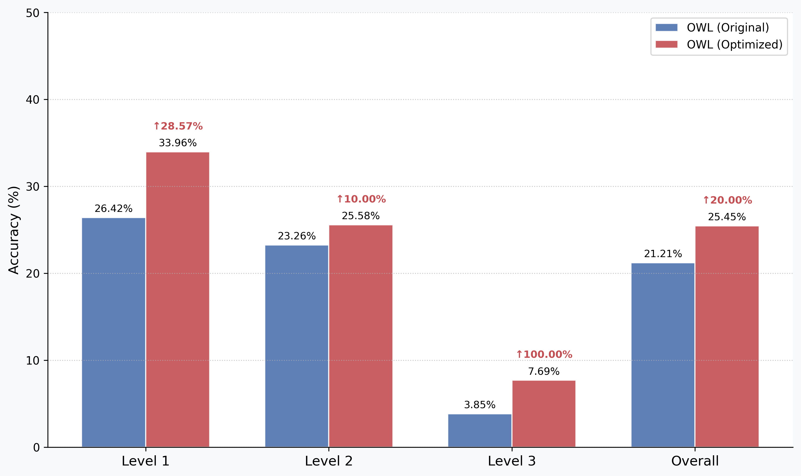

# OWL Project Reproduction Report

> **Note**: This report outlines reproduction steps, environment details, and issues discovered when forking and running the Camel-AI OWL project using our **S**elf-**E**volving **W**orkflow (**SEW**).  
[OWL](https://github.com/camel-ai/owl) is an open-source agentic framework developed by [Camel-AI](https://github.com/camel-ai/camel), designed to enable general-purpose multi-agent collaboration in solving real-world tasks. It provides a flexible and extensible platform for building, coordinating, and deploying multiple intelligent agents across a wide range of practical applications.
---

## 1. Comparison between SEW enhanced OWL and OWL on the GAIA benchmark (validation set)


## 2. Why OWL?

- **Reasons**: We choose OWL since it is claimed to be ranked #1 among open-source frameworks on the GAIA benchmark!


## 3. What have we changed?
- **Modifications**:
  1. Change the framework into multithreading.
  2. Use **SEW** to enhance the OWL.
## 4. Issues
  1. The code for reproducing the best variant of owl i.e., **workforce workflow** is missing (check more details [here](https://github.com/camel-ai/owl/issues/496)).
  2. The code for the second-best variant of owl i.e., **role-palying workflow** is not reproducible (check more details [here](https://github.com/camel-ai/owl/issues/503)).

## 5. Environment

```bash
# Clone github repo
git clone https://github.com/camel-ai/owl.git

# Change directory into project directory
cd owl

# Create a virtual environment
# For Python 3.10 (also works with 3.11, 3.12)
python3.10 -m venv .venv

# Activate the virtual environment
# For macOS/Linux
source .venv/bin/activate
# For Windows
.venv\Scripts\activate

# Install from requirements.txt
pip install -r requirements.txt --use-pep517
```
## **Setup Environment Variables**

OWL requires various API keys to interact with different services.

### Setting Environment Variables Directly

You can set environment variables directly in your terminal:

- **macOS/Linux (Bash/Zsh)**:
  ```bash
  export OPENAI_API_KEY="your-openai-api-key-here"
  # Add other required API keys as needed
  ```

- **Windows (Command Prompt)**:
  ```batch
  set OPENAI_API_KEY=your-openai-api-key-here
  ```

- **Windows (PowerShell)**:
  ```powershell
  $env:OPENAI_API_KEY = "your-openai-api-key-here"
  ```

## 4. Reproduce Results
   ```bash
cd owl/examples
python run_gaia_roleplaying.py
```
